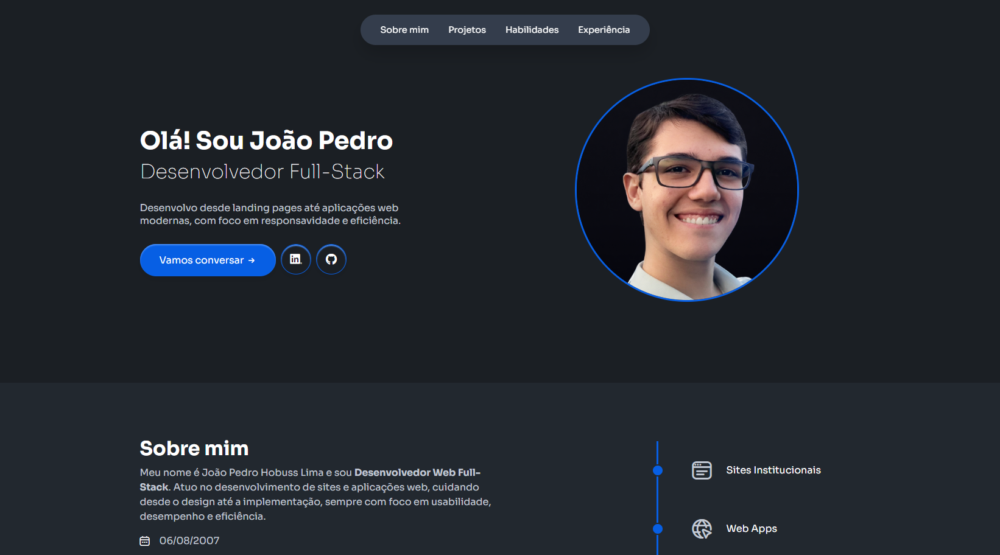

# Portfólio / Currículo

Meu site pessoal de portfólio e currículo, desenvolvido para apresentar meus projetos, habilidades e serviços.

## 🚀 Tecnologias Utilizadas

- HTML
- CSS
- JavaScript

## ✨ Funcionalidades

- Página de apresentação pessoal
- Sessão de projetos
- Informações profissionais
- Layout responsivo
- Navegação simples e objetiva

## 🎯 Objetivo

Criar uma presença online profissional para apresentar meu trabalho como desenvolvedor e designer.

## 📸 Preview

## 📚 Aprendizados

- Estruturação de páginas institucionais
- Design responsivo
- Organização visual de portfólio
- Boas práticas de HTML e CSS
